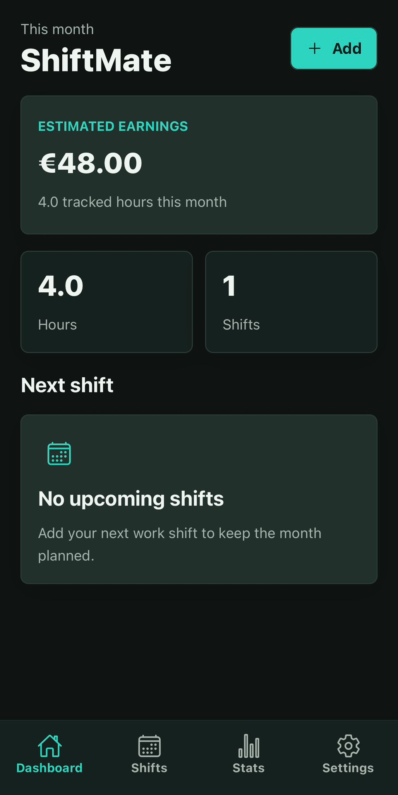
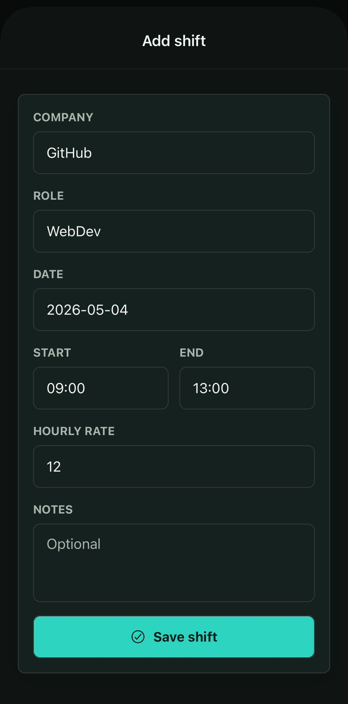
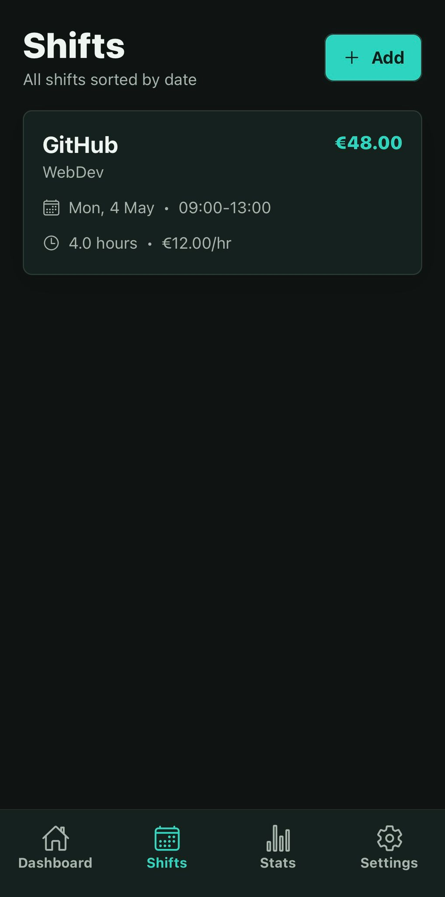
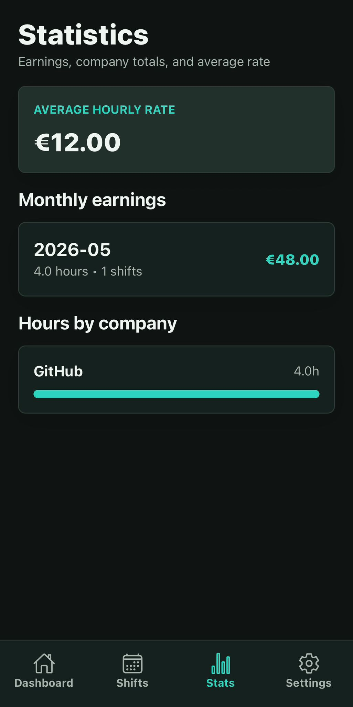
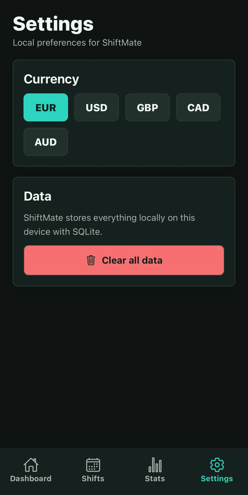

# ShiftMate

Preprost mobile app za sledenje študentskim uram (ure + zaslužek).

Narejeno kot vadni projekt v React Native (Expo). Vse teče lokalno, brez backenda.

## Setup

```bash
npm install
npx expo start
```

... in skeniraj QR kodo z Expo Go na telefonu.

## Kaj sploh dela?

- Dashboard: ure ta mesec, približen zaslužek, število šihtov, naslednji šiht
- Seznam šihtov (po datumu)
- Dodaj / uredi / izbriši šiht
- Osnovna validacija (ure, rate, itd.)
- Statistika (mesečni zaslužek, ure po podjetju, povprečen rate)
- Nastavitve (valuta + reset podatkov)
- Light / dark mode
- Demo podatki ob prvem zagonu

## Uporabljene tehnologije

- Expo
- React Native
- TypeScript
- Expo Router
- SQLite (expo-sqlite)

## Screenshoti

### Dashboard



### Dodaj smeno



### Vse smene



### Statistika



### Nastavitve


